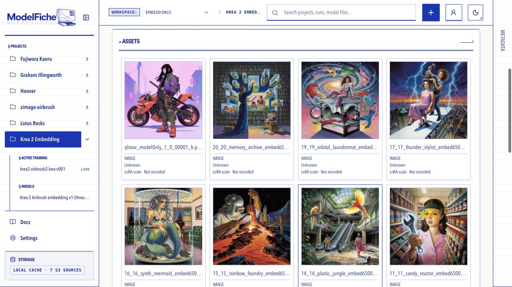
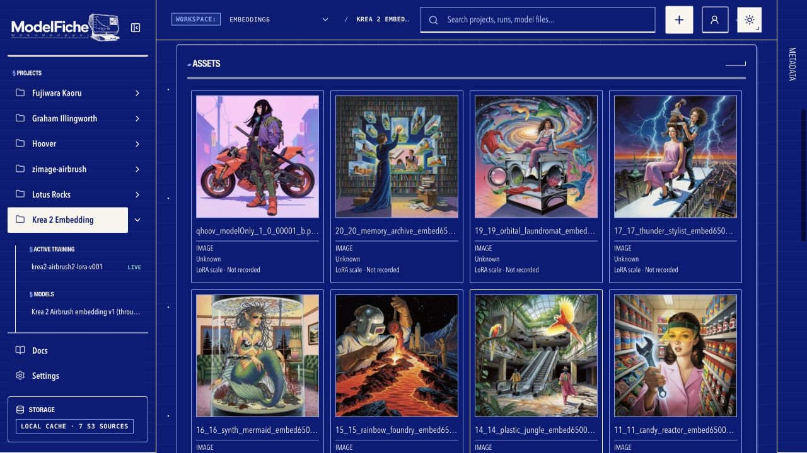

<div align="center">

# ModelFiche

### An agent-first workbench for image-model training.

**Automate with the CLI. Bring in your training data. Compare checkpoints visually.**

[CLI & agents](#cli-and-agents) · [AI Toolkit + W&B](#training-data) · [FAL + training grids](#fal-and-grids) · [Features](#features) · [Get started](#get-started)

</div>

**ModelFiche is built for agents and the people training image models with them.**
Its `mfiche` CLI lets coding agents and scripts organize datasets, prepare training,
inspect runs, generate evaluations, and manage model files. A visual UI gives you
one place to inspect the images, compare results, and decide what to keep.

Connect **AI Toolkit's W&B logging** to bring in training metrics and samples.
Connect **FAL** to generate images and evaluation grids. Keep datasets, captions,
checkpoints, LoRAs, conditioning embeddings, and review decisions connected in a
local-first workspace.



<a id="cli-and-agents"></a>

## 🤖 Agent-first, with a real CLI

**The `mfiche` CLI is a core interface to ModelFiche.** Your agent can operate the
workbench through structured commands while you use the UI for visual inspection.
Both work with the same API, projects, assets, and history.

Give a coding agent the [agent guide](docs/AGENT_GUIDE.md) and access to `mfiche`.
Then ask it to work on your actual training project:

> Inspect my latest training run. Compare its loss metrics and samples across
> checkpoints, identify candidates worth testing, and prepare a grid plan using
> the same prompts and seed.

The CLI covers the workflow from data preparation to review:

- **Prepare:** import datasets and existing runs, edit or generate captions,
  publish dataset versions, and prepare trainer packets.
- **Observe:** inspect live training status, loss metrics, configuration,
  samples, checkpoints, and their lineage.
- **Evaluate:** discover provider schemas, prepare and queue FAL evaluations
  and grids, and inspect generated results.
- **Keep and maintain:** record ratings and notes, approve model versions,
  export artifacts, and create or verify backups.

Agents get **JSON output, discoverable capabilities, explicit workspace context,
structured errors, request IDs, and durable job tracking**. Long-running imports
and generation have identities your agent can inspect and follow through to
completion.

[Explore the CLI →](docs/CLI.md) · [Give your agent the operating guide →](docs/AGENT_GUIDE.md)

<a id="training-data"></a>

## 📈 Bring in training data from AI Toolkit + W&B

**Connect the W&B logger in AI Toolkit to ModelFiche to bring your training data
into the workbench as the run progresses.** See losses, learning rates,
configuration, image samples, and captions alongside the run they belong to.

ModelFiche provides its own **W&B-compatible logging endpoint** for the supported
trainer integration. The trainer's W&B SDK sends data directly to ModelFiche;
**no wandb.ai account is required**.

- **Prepare a training packet:** a versioned dataset export, trainer configuration,
  logging environment, checksums, and a checkpoint-sync helper.
- **Follow training live:** inspect scalar metrics and samples by training step,
  in the UI or through the CLI.
- **Keep checkpoints connected:** bring checkpoint files back through
  S3-compatible storage, with their run and dataset history attached.
- **Bring in earlier experiments:** import existing datasets and training-run
  artifacts from local folders or S3-compatible archives.
- **Work with supported embedding training:** prepare `kef-krea2` launches and
  track conditioning-embedding artifacts alongside LoRA experiments.

AI Toolkit runs the training in your trainer environment. ModelFiche receives the
results and gives you and your agent the context to understand them.

The live integration uses the pinned **`wandb==0.28.0`** SDK and requires a
ModelFiche logging endpoint reachable from the trainer. Checkpoint storage and
live logging are separate connections; an S3 backup alone does not populate
live loss graphs or samples.

[Connect AI Toolkit and W&B logging →](docs/WANDB_COMPATIBILITY.md)

<a id="fal-and-grids"></a>

## 🧪 Connect FAL. Make training grids. Find convergence.

**Connect your FAL credential to generate images, run model evaluations, and build
saved comparison grids from ModelFiche.** Use supported endpoints with compatible
model versions and checkpoints; the controls and available parameters follow the
selected endpoint's schema.

Training grids help answer the practical question: **when has this model learned
enough, and which checkpoint should I keep?**

Compare existing training samples by step, or generate a fresh evaluation grid
across checkpoint-backed model versions. Hold prompts and seeds fixed to see how
the images change as training progresses. Look for stable results, diminishing
improvements, or signs of overfitting, alongside the loss graph. These comparisons
help you judge convergence and choose a checkpoint.

| Comparison | What it helps you decide |
| --- | --- |
| **Checkpoint × prompt** | Where the model starts producing consistent results across subjects. |
| **Checkpoint × LoRA strength** | Which checkpoint and strength give the effect you want. |
| **Model × prompt** | Which model version generalizes best to your evaluation prompts. |
| **Prompt × seed** | Whether a result holds up across seeds. |
| **Supported endpoint parameters** | How generation settings change the result while other variables stay fixed. |

Build **X/Y grids with an optional Z axis**, save the experiment definition,
inspect individual cells, and open the grid full screen to zoom and scan.
Export grid images to share comparisons. Reusable prompt sets and optional
AI-assisted prompt creation help keep evaluations consistent.

FAL generation uses your configured provider account and is a paid service.
Available models, grid axes, and parameters depend on the supported endpoint.

[CLI evaluation and grid workflows →](docs/CLI.md#image-eval-and-grid-generation) · [Endpoint and grid reference →](FAL_ENDPOINT_SCHEMAS.md)

<a id="features"></a>

## 🗂️ The rest of the workbench

Everything stays organized around **workspaces → projects → datasets, runs,
models, and evaluations**, so automation and visual review share the same context.

| Feature | What you can do |
| --- | --- |
| **Workspaces and projects** | Separate experiments, browse project overviews, and search your workspace. |
| **Dataset curation** | Inspect images, select what belongs in a dataset, organize named subsets, and publish immutable versions. |
| **Caption editing** | Edit text or JSON captions, apply batch operations and find/replace, and track caption versions and history. |
| **AI assistance** | Generate image captions and draft evaluation prompt sets with a configured LLM provider. |
| **Training inspection** | View run configuration, loss graphs, learning rates, samples, checkpoints, and live status when logging is connected. |
| **Model and embedding records** | Register model files and versions, preserve artifact types and trigger-word metadata, and track approved or archived versions. |
| **Gallery and full-screen review** | Browse source images, training samples, and generated outputs; filter by project, model, dataset, rating, or decision. |
| **Ratings, notes, and decisions** | Rate images, record comments and review decisions, and keep project and dataset notes with history. |
| **Lineage and provenance** | Trace images and model versions back through evaluations, checkpoints, runs, and dataset versions; inspect embedded image metadata. |
| **Local and S3-compatible imports** | Bring in datasets, training archives, and supported embedding bundles while preserving artifact metadata and relationships. |
| **Remote asset access** | Browse verified remote originals without downloading every asset into the local cache. |
| **Exports** | Export dataset and model versions, download checkpoints, and save comparison-grid images. |
| **Queues and transfers** | Follow generation, imports, exports, and asset transfers through persistent jobs and visible status. |
| **Backup and recovery** | Create and verify backups, restore local state, recover interrupted restores, and use database-only backups when originals are stored remotely. |
| **Local app, browser, and CLI** | Run the macOS app or a source checkout, with optional authenticated remote access and built-in documentation. |

<details>
<summary><strong>🌙 Prefer dark mode? See the same gallery in blue.</strong></summary>



</details>

<a id="get-started"></a>

## 🚀 Get started

### macOS app

Visit [Releases](https://github.com/latentwill/modelfiche/releases) for available
builds. Download the DMG, drag **ModelFiche** into Applications, and open it.
The bundle includes the local API, worker, web UI, and `mfiche` CLI. Settings can
install the packaged CLI into `~/.local/bin/mfiche`.

**Current status:** active development, designed for a single operator. macOS
artifacts are unsigned. See [Security](SECURITY.md) for the supported deployment
boundary and remote-access limitations.

### Run from source

Requires **Python 3.11+, uv, Node.js, and pnpm**.

```bash
git clone https://github.com/latentwill/modelfiche.git
cd modelfiche
uv sync --extra dev --extra compat-wandb
pnpm --dir apps/web install
uv run alembic upgrade head
uv run mfiche start
```

Open **http://127.0.0.1:5173**. Use `uv run mfiche status` to check the stack
and `uv run mfiche stop` to stop it. See [Contributing](CONTRIBUTING.md) for
development details.

### Connect your agent

From the checkout, discover the CLI and select the workspace you want to use:

```bash
uv run mfiche --help
uv run mfiche --json capabilities
uv run mfiche --json workspace list
uv run mfiche --json --workspace <workspace-id-or-slug> project list
uv run mfiche --json --workspace <workspace-id-or-slug> run list
```

Use `mfiche` directly when installed on your `PATH`. Give your agent the
[agent guide](docs/AGENT_GUIDE.md), and use an explicit workspace ID or slug for
scoped reads and writes. The browser and CLI have independent workspace selections.

### Connect your training and generation

1. **Set up your workspace:** configure a profile in Settings, then create a
   project or import existing work through the UI or CLI.
2. **Connect storage:** configure S3-compatible storage for remote assets and
   checkpoint handoff.
3. **Connect AI Toolkit:** follow the [W&B logging guide](docs/WANDB_COMPATIBILITY.md),
   prepare the trainer packet, and verify that metrics and samples reach ModelFiche.
4. **Connect FAL:** configure your credential and check available endpoints and
   compatible model versions.
5. **Compare and iterate:** inspect training samples, build checkpoint comparison
   grids, record your decisions, and choose what to train or evaluate next.

## 📚 Documentation

| Guide | What's inside |
| --- | --- |
| [Agent guide](docs/AGENT_GUIDE.md) | Automation contract, workspace context, job tracking, and copy-ready recipes |
| [CLI guide](docs/CLI.md) | Commands, JSON output, training, imports, evaluations, grids, and review |
| [AI Toolkit & W&B logging](docs/WANDB_COMPATIBILITY.md) | Trainer packets, live metrics, samples, and checkpoint handoff |
| [FAL endpoint and grid reference](FAL_ENDPOINT_SCHEMAS.md) | Endpoint fields, supported comparison dimensions, and request construction |
| [Installation & operations](docs/OPERATIONS.md) | App setup, remote access, storage, credentials, backup and restore |
| [Contributing](CONTRIBUTING.md) | Development setup, tests, migrations, and release builds |
| [Security](SECURITY.md) | Deployment boundaries and vulnerability reporting |

For architecture, product definitions, and compatibility references, visit the
[documentation index](docs/README.md).
